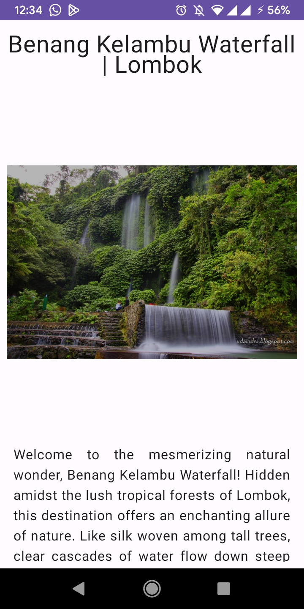
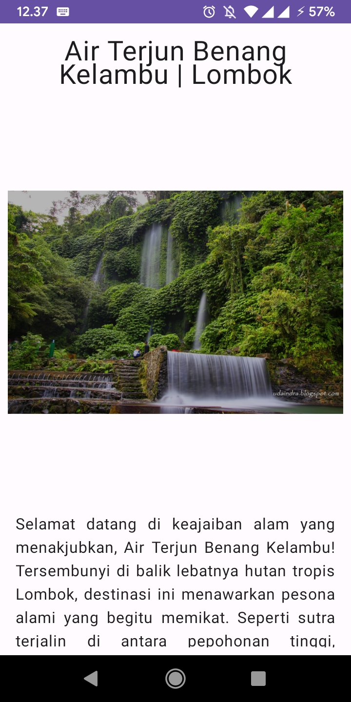
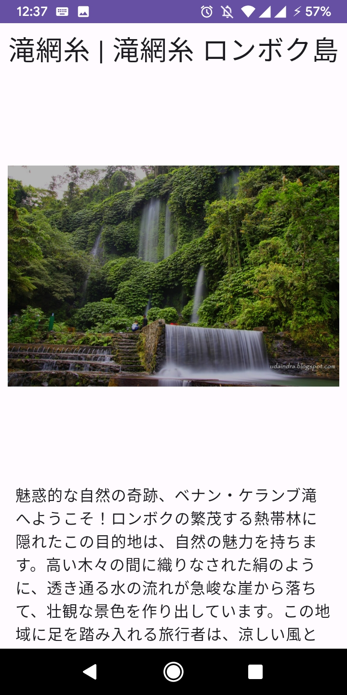

# Localization Project Example

## Tentang project
> project ini mendemonstrasikan penggunaan localization dalam android

>localization berkerja dengan cara membuat versi lain dari file original yang ingin di transalasikan,
> versi tersebut biasanya menggunakan qualifier tambahan. pada project ini qualifier yang digunakan
> adalah **qualifier** **locale**
> 
> ada **3** qualifier locale yang digunakan yaitu **IN (Bahasa), EN (English), JA (Japanese)**

## Screenshot Aplikasi

. **Tampilan dengan bahasa Inggris dan default**

. **Tampilan dengan bahasa Indonesia**

. **Tampilan dengan bahasa Jepang**

